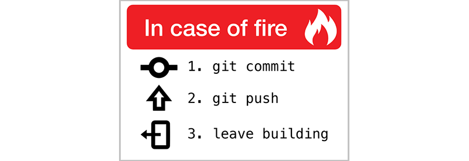

# Git basics

Three good reasons for use a version control software on daily basis:

+ backup of your source code
+ keep track of code changes (history)
+ force to apply a workflow when working in team

Choose the tool that best fits your habits. I suggest **Git** because it's widely used, powerful, and easy to integrate on most IDE. There are also a lot of website that offer free online storage for your opensource projects.

## Overview

Official site here: [Git](https://git-scm.com/)

Another good source of information can be the Atlassian software development portal: [Getting Git Right](https://www.atlassian.com/git)

Git permits different workflows based on the way branches are organized. A common approach is named [Gitflow](https://www.atlassian.com/git/tutorials/comparing-workflows/gitflow-workflow), typically each company adapt these guidelines on their specific projects.


Some personal notes when defining workflow, branches, operations:

+ Think about team size and member's expertise
+ Conflicts issues during pull/merge request must be resolved in a short time
+ Create new branches is cheap
+ Frequent commits
+ Push daily (means backup on remote server)
+ Learn it via bash then go for GUI

## Installation

Download and run the [Installer](https://git-scm.com/downloads).

Then configure your local account:

```cpp
git config --global user.name “YOUR USERNAME”
git config --global user.email “YOUREMAILADDRESS@EXAMPLE.COM”
```

Check your current configuration:

```cpp
git config --global --list
```

## Remote and local repo

Most of the time you will contribute to an existing project. The first step is to get a local copy of the sourcecode from the repository (remote server).

```cpp
git clone <put here URL of repository>
```

Be aware that hidden folder ".git" contains inside information and history of the repository. Don't delete it and don't edit the content.

## Daily operations

### Pull

Keep your local branches synchronized, run the **git pull** command in order to fetch and download content from remote repository.

```cpp
git pull
git pull <put here URL of repository>
git pull --verbose
```

### Branch and Checkout

Before changing anything on your local copy make sure you are working on the right branch, list them:

```cpp
git branch
git branch --list
```

To create a local branch:

```cpp
git branch <put here name>
```

To create a remote branch:

```cpp
git remote add <remote branch name> <put here URL of repository>
```

Change (local) current working branch using:

```cpp
git checkout <put here branch name>
```

### Status, Add and Commit

Be familiar with the concept of [staging area](https://git-scm.com/about/staging-area), and verify the current status with:

```cpp
git status
```

Then add files and changes you want to commit via:

```cpp
git add <filename>
git add <directory>
git add -u              <- stage modified and deleted files only (already part of the index)
git add .               <- stage all files in the entire repository
```

Finally create a snapshot of these changes, it will be available in the history of **commits** of the branch.

```cpp
git commit -m "commit short description"
git commit
```

I strongly suggest to use **git commit**, in order to open the predefined editor and write a complete description of the changes, including:

+ First line: short and clear headline
+ Second line: always empty
+ Third line and others: all useful information
+ Please list the missing features (still ongoing or todo)
+ Add guidelines to compile the project, test it, and run simulations
+ Put notes for the "you from the future"

Some tips are available [here](https://www.conventionalcommits.org/en/v1.0.0/). When closing the editor the commit will be automatically done. Check the history via:

```cpp
git log --oneline
git log -p <commit A sha> <commit B sha>
git show <commit sha>
git show <commit sha> --stat
git show <commit sha>:filepathname > filepathname_of_the_copy
```

If you want to get rid of all your changes (staged and not) and go back to the last commit use:

```cpp
git reset --hard
```

### Push

Upload your local repository content to the remote one, via **git push** command:

```cpp
git push
git push <remote branch name>
```

If you want to configure a relationship between your local branch and a remote one proceed as:

```cpp
git checkout <local branch>
git branch --set-upstream-to=<remote repo/branch>
git branch -vv
```



### Stash

Sometimes you have to switch quickly to other branches (to fix a bug or check something ... ) but you can't do it if you already did some changes. At the same time you don't want to loose your current sourcecode.

The **git stash** command can help you, temporary storing your changes, then they can be retrieved any time in the future. Please [read here](https://www.atlassian.com/git/tutorials/saving-changes/git-stash).

## Files management

There are some files you may want Git to ignore and not track in your repository. These include many that are auto-generated (by IDE) or platform-specific, as well as other local configuration files or compiled code (.elf .exe .bin).

To do that create a hidden file name **".gitignore"** and edit putting inside all folders and name files that you want to ignore. Please note that multiple .gitgnore files can be created inside each project folder for better filter granularity. [Here some templates](https://github.com/github/gitignore)

Example for Atmel embedded project:

```cpp
## Ignore Atmel Studio temporary files and build results
# https://www.microchip.com/mplab/avr-support/atmel-studio-7

# Atmel Studio is powered by an older version of Visual Studio,
# so most of the project and solution files are the same as VS files,
# only prefixed by an `at`.

#Build Directories
[Dd]ebug/
[Rr]elease/

#Build Results
*.o
*.d
*.eep
*.elf
*.hex
*.map
*.srec

#User Specific Files
*.atsuo
```

Other files are usually part of the repository:

+ **README.md** Short project info, installation and configuration, sw architecture, and notes.
+ **CONTRIBUTE.md** Guideline for contributing to the project.
+ **LICENSE.md** Software license information

## Links and resources

[Git guide from Github platform](https://github.com/git-guides)

[Gitflow in 5 minutes](https://youtu.be/1SXpE08hvGs)

[Git tutorial from freeCodeCamp.org](https://youtu.be/Uszj_k0DGsg)

Third-party Git GUI clients: [Tortoise Git](https://tortoisegit.org/), [GitHub Desktop](https://desktop.github.com/), [Sourcetree](https://www.sourcetreeapp.com/)
